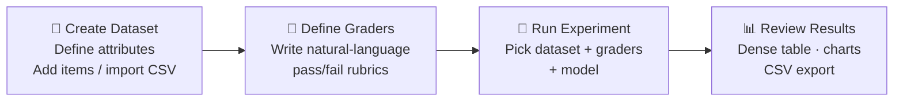
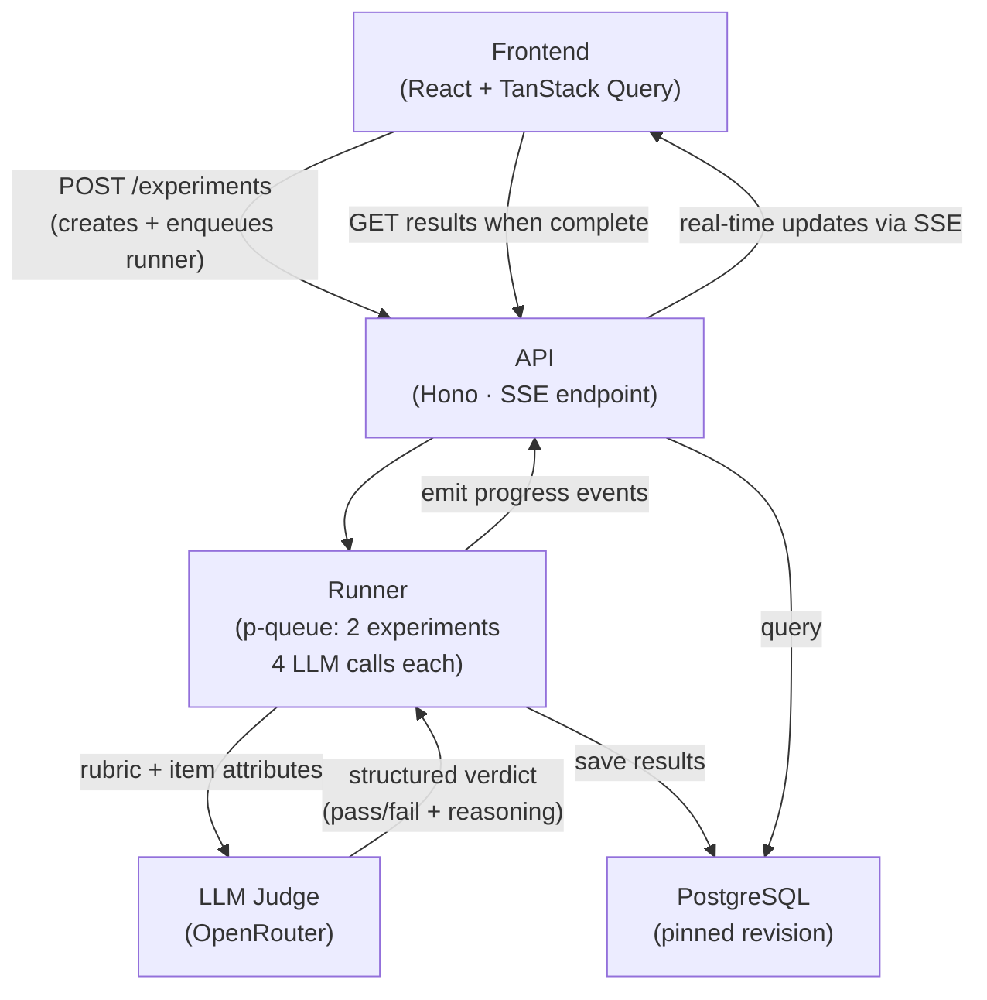

# Eval Harness

A lightweight evaluation harness for running LLM graders against test datasets. Build datasets of test cases, define grading rubrics, run experiments, and review results in a dense, scannable interface.

## What it does

- Create datasets with custom attributes (input, expected_output, plus any custom fields)
- Define graders with natural-language rubrics for LLM-based evaluation
- Run experiments that evaluate every test case against selected graders, using a model you choose per experiment
- Select from 14 pre-configured models grouped by provider (Anthropic, OpenAI, Google, Meta, Mistral, DeepSeek)
- Review results in a dense table — rows are items, columns are graders, cells show pass/fail verdicts
- Dataset versioning via immutable revisions — experiments pin to a snapshot, so results are reproducible
- Author versioned prompts — pair system and user messages with model configuration, with full version history
- Prompt-experiment integration — every experiment requires a prompt; the prompt drives LLM generation per item (Phase 1), and the generated output is then graded (Phase 2)

## Workflow

### User Workflow



### System Flow



> Full data model and layer details in [docs/architecture.md](docs/architecture.md).

## Tech Stack

| Layer      | Tech                       |
| ---------- | -------------------------- |
| Monorepo   | Turborepo + pnpm           |
| Backend    | Hono + Node.js             |
| Database   | PostgreSQL 17 + Prisma ORM |
| Frontend   | React 19 + Vite            |
| UI         | shadcn/ui + Tailwind CSS   |
| State      | TanStack Query             |
| LLM        | Vercel AI SDK + OpenRouter |
| Validation | Zod                        |
| Testing    | Vitest                     |

## Project Structure

```
├── apps/
│   ├── api/          # Hono REST API
│   └── web/          # React + Vite frontend
├── packages/
│   ├── db/           # Prisma schema + migrations
│   ├── shared/       # Result<T> type utilities
│   ├── eslint-config/
│   └── typescript-config/
├── docs/             # Spec, architecture, requirements
└── scripts/          # E2E smoke tests
```

## Getting Started

Prerequisites: Node.js 18+, pnpm 9+, Docker

```bash
# 1. Install dependencies
pnpm install

# 2. Start PostgreSQL
docker compose up -d

# 3. Set up environment
cp .env.example .env
# Edit .env with your OPENROUTER_API_KEY

# 4. Push database schema
pnpm --filter db exec prisma migrate dev

# 5. Start development servers
pnpm dev
```

API runs on http://localhost:3001, frontend on http://localhost:5173

## Scripts

| Command          | Description                 |
| ---------------- | --------------------------- |
| `pnpm dev`       | Start API + web in dev mode |
| `pnpm build`     | Build all packages          |
| `pnpm test`      | Run unit tests              |
| `pnpm lint`      | Lint all packages           |
| `pnpm typecheck` | Type-check all packages     |
| `pnpm format`    | Format with Prettier        |

## Try It Out

The `test-data/` directory includes everything you need to see the harness in action: a sample dataset, four pre-written graders, and a seed script that sets it all up in one command.

### Quick start (automated)

With the dev server running:

```bash
./test-data/seed.sh
```

This creates a "Customer Support QA" dataset with 30 test cases, four graders (Helpfulness, Tone & Empathy, Accuracy, Completeness), and three pre-seeded experiments with pre-computed results:

- **Baseline GPT-4o Run** (~90% pass)
- **Gemini Flash Run** (~63% pass)
- **Claude Haiku Run** (~43% pass)

Open the UI at http://localhost:5173 to explore the seeded experiments immediately — no API key needed to browse results. An `OPENROUTER_API_KEY` is only required to run new experiments.

### What's included

**[customer-support-dataset.csv](test-data/customer-support-dataset.csv)** — 30 customer support interactions across billing, account, technical, product, and policy categories. Each row has an `input` (customer message), `expected_output` (ideal response), `category`, and `difficulty` (easy/medium/hard). You can also import this CSV manually from the Datasets page in the UI.

> **Note:** The seed script requires Docker. The `eval-harness-db` container must be running because the script uses `docker exec` to insert experiment results directly via psql.

**[recommended-evals.md](test-data/recommended-evals.md)** — Four grader rubrics designed for this dataset. Each grader evaluates a different dimension of response quality:

| Grader         | What it evaluates                                                                      |
| -------------- | -------------------------------------------------------------------------------------- |
| Helpfulness    | Does the response actually answer the question with actionable next steps?             |
| Tone & Empathy | Is the tone professional and calibrated to the customer's emotional state?             |
| Accuracy       | Are all facts consistent with the expected output — no contradictions or fabrications? |
| Completeness   | Does the response address every part of the question without omitting key details?     |

You can use these rubrics as-is or adapt them for your own datasets. The seed script creates all four automatically, or you can copy them from the markdown file and create graders manually in the UI.

**[recommended-prompts.md](test-data/recommended-prompts.md)** — Two prompt templates designed for this dataset. Each pairs a system message with a user message template and model configuration:

| Prompt                           | Model           | What it does                                                    |
| -------------------------------- | --------------- | --------------------------------------------------------------- |
| Professional Support Agent       | Claude Sonnet 4 | Clear, professional responses with actionable next steps        |
| Empathetic Resolution Specialist | GPT-4o          | Warmly empathetic responses that lead with emotional connection |

The seed script creates both prompts automatically (the Professional Agent gets a v2 with adjusted temperature). You can also copy the prompts from the markdown file and create them manually in the UI.

## Documentation

- [Architecture](docs/architecture.md) — data model, backend layers, frontend structure
- [Specification](docs/spec.md) — detailed behavior spec
- [Implementation](docs/implementation.md) — API contracts and data model details

## What I'd Improve

- **Job queue** — Replace in-process p-queue with BullMQ + Redis. Current setup loses jobs on restart and doesn't scale horizontally.
- **Revision storage** — Switch from full-copy revisions to a log-based approach (append-only deltas). Current model duplicates all items per revision.
- **Results storage** — Move experiment results to a columnar store (ClickHouse) for faster analytical queries at scale.
- **Prompt playground** — Add an interactive playground so users can execute prompts against models directly, iterate on outputs, and evaluate results in one workflow. (Prompt versioning and management is now implemented.)
- **Re-run with a different model** — Allow re-running an existing experiment with a different LLM model to compare outputs across models without recreating the experiment.

## License

MIT
